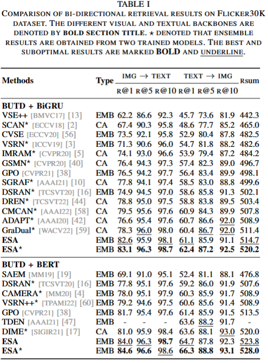
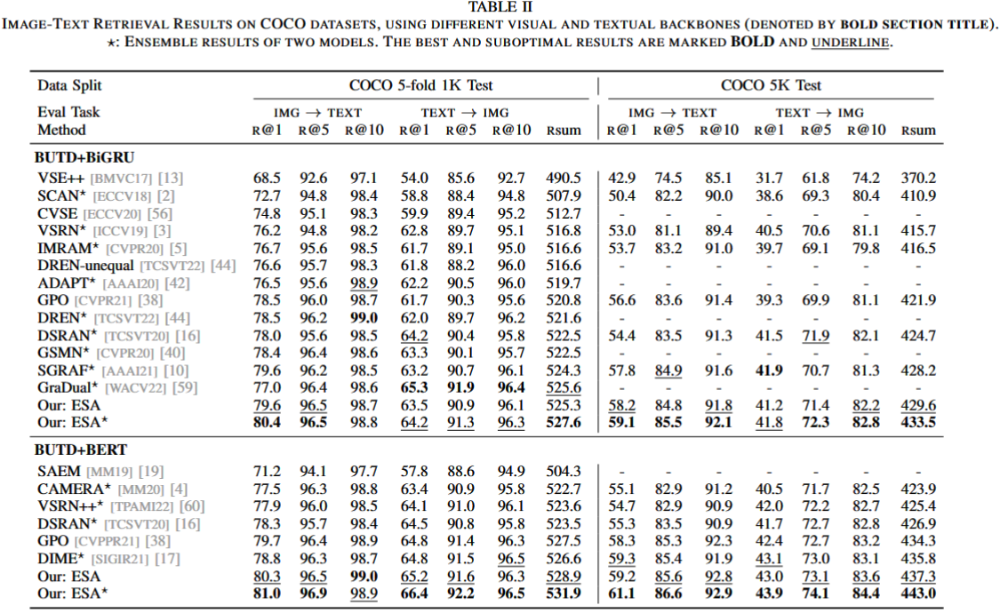

# ESA: External Space Attention Aggregation for Image-Text Retrieval
 [](https://github.com/KevinLight831/ESA/blob/main/LICENSE)

The pytorch code of the TCSVT 2023 paper [“ESA: External Space Attention Aggregation for Image-Text Retrieval”](https://ieeexplore.ieee.org/document/10061465) (Finished in 2021)

We referred to the implementations of [VSE++](https://github.com/fartashf/vsepp), [SCAN](https://github.com/kuanghuei/SCAN) and [vse_infy](https://github.com/woodfrog/vse_infty) to build up our codebase. 

## :open_book: Introduce
Due to the large gap between vision and language modalities, effective and efficient image-text retrieval is still an unsolved problem. 
Recent progress devotes to unilaterally pursuing retrieval accuracy by either entangled image-text interaction or large-scale vision-language pre-training in a brute force way. However, the former often leads to unacceptable retrieval time explosion when deploying on large-scale databases. The latter heavily relies on the extra corpus to learn better alignment in the feature space while obscuring the contribution of the network architecture. 
In this work, we aim to investigate a trade-off to balance effectiveness and efficiency. To this end, on the premise of efficient retrieval, we propose the plug-and-play External Space attention Aggregation (ESA) module to enable element-wise fusion of modal features under spatial dimensional attention. Based on flexible spatial awareness, we further propose the Self-Expanding triplet Loss (SEL) to expand the representation space of samples and optimize the alignment of embedding space.
The extensive experiments demonstrate the effectiveness of our method on two benchmark datasets.
With identical visual and textual backbones, our single model has outperformed the ensemble modal of similar methods, and our ensemble model can further expand the advantage.
Meanwhile, compared with the vision-language pre-training embedding-base method that used $83\times$ image-text pairs than ours, our approach not only surpasses in performance but also accelerates $3\times$ on retrieval time.

## :balance_scale: The Reported Results

### Flicker30K dataset

<p align="center"></p>

### COCO dataset

<p align="center"></p>

## :pushpin: Pretrained Model Weight 
The following tables show partial results of the ensemble model ESA* and the download link of pretrained weight on Flickr30K and COCO datasets. The folder "ESA_BIGRU" provides the code of using BIGRUas the textual backbone. Please check out to the folder "ESA_BERT" for the code of using BERT-base as the textual backbone. 

| dataset                     | Visual Backbone | Text Backbone | IR1            | IR5            | TR1            | TR5            | Rsum             | Link     |
| --------------------------- | :-------------: | :-----------: | -------------- | -------------- | -------------- | -------------- | ---------------- | -------- |
| Flickr30K                   |   BUTD region   |     BiGRU     | 83.1           | 96.3           | 62.4           | 87.2           | 520.2            | [Here](https://drive.google.com/drive/folders/1u6McZdcu1dTXn9uS9IYH6MsrqNCdJnYo?usp=drive_link) |
| Flickr30K                   |   BUTD region   |   BERT-base   | 84.6           | 96.6           | 66.3           | 88.8           | 528.0            | [Here](https://drive.google.com/drive/folders/1oY-w0q64MeTB83rPRBtqPd1X4oHnkmrj?usp=drive_link) |
| COCO 5-fold 1K <br> COCO 5k |   BUTD region   |     BiGRU     | 80.4 <br> 59.1 | 96.5 <br> 85.5 | 64.2 <br> 41.8 | 91.3 <br> 72.3 | 527.6 <br> 433.5 | [Here](https://drive.google.com/drive/folders/1gXslTklR_YnkIjpF4QN-eqSFQ52yP1L_?usp=drive_link) |
| COCO 5-fold 1K <br> COCO 5k |   BUTD region   |   BERT-base   | 81.0 <br> 61.1 | 96.9 <br> 86.6 | 66.4 <br> 43.9 | 92.2 <br> 74.1 | 531.9 <br> 443.0 | [Here](https://drive.google.com/drive/folders/1yioepvwz1_59CoICBOqBt-lYnk077v5a?usp=drive_link) |

## :wrench: Setup and Environments
    Python: 3.6
    RTX 3090
    Ubuntu 14.04.6 LTS

Install packages:
```
conda env create -f ESA.yaml
```

## :file_folder: Dataset


All dataset used in the experiments are organized in the following manner:

```
data
├── coco
│   ├── precomp  # pre-computed BUTD region features for COCO, provided by SCAN
│   │      ├── train_ids.txt
│   │      ├── train_caps.txt
│   │      ├── ......
│   │
│   ├── images   # raw coco images
│        ├── train2014
│        └── val2014
│  
├── f30k
│   ├── precomp  # pre-computed BUTD region features for Flickr30K, provided by SCAN
│   │      ├── train_ids.txt
│   │      ├── train_caps.txt
│   │      ├── ......
│   │
│   ├── flickr30k-images   # raw coco images
│          ├── xxx.jpg
│          └── ...
│   
└── vocab  # vocab files provided by SCAN (only used when the text backbone is BiGRU)
```

The download links for original COCO/F30K images, precomputed BUTD features, and corresponding vocabularies are from the offical repo of [SCAN](https://github.com/kuanghuei/SCAN#download-data). The ```precomp``` folders contain pre-computed BUTD region features, ```data/coco/images``` contains raw MS-COCO images, and ```data/f30k/flickr30k-images``` contains raw Flickr30K images. 
Because the download link for the pre-computed features in [SCAN]((https://github.com/kuanghuei/SCAN)) is seemingly taken down. The [link](https://www.dropbox.com/sh/qp3fw9hqegpm914/AAC3D3kqkh5i4cgZOfVmlWCDa?dl=0) provided by the author of [vse_infty](https://github.com/woodfrog/vse_infty) contains a copy of these files. 


## :mag: Train and Evaluation
Training on the Flicker30K or COCO dataset:
1. Switch to the shell folder in the corresponding path. For example:
  ```
  cd ./ESA_BIGRU/shell/
  ```
2. run ./train_xxx_f30k.sh or ./train_xxx_coco.sh. For example:
  ```
  sh train_GRU_f30k.sh
  ```
3. Evaluation: Run the following commands after modifing the default data and model path to yourself path.
  ```
  cd ../
  python eval_ensemble.py
  ```


## :pencil: Citation
If this codebase is useful to you, please cite our work:
```
@article{zhu2023esa,
  title={ESA: External Space Attention Aggregation for Image-Text Retrieval},
  author={Zhu, Hongguang and Zhang, Chunjie and Wei, Yunchao and Huang, Shujuan and Zhao, Yao},
  journal={IEEE Transactions on Circuits and Systems for Video Technology},
  year={2023},
  publisher={IEEE}
}
```
If you have any question, please feel free contact me: hongguang@bjtu.edu.cn or kevinlight831@gmail.com

### Reference
1. Chen, Jiacheng, et al. "[Learning the best pooling strategy for visual semantic embedding.](https://github.com/woodfrog/vse_infty)" Proceedings of the IEEE/CVF conference on computer vision and pattern recognition. 2021.
2. Faghri, Fartash, et al. "[Vse++: Improving visual-semantic embeddings with hard negatives.](https://github.com/fartashf/vsepp)" arXiv preprint arXiv:1707.05612 (2017).
3. Lee, Kuang-Huei, et al. "[Stacked cross attention for image-text matching.](https://github.com/kuanghuei/SCAN)" Proceedings of the European conference on computer vision (ECCV). 2018.
4. Diao, Haiwen, et al. [Cross-modal_Retrieval_Tutorial](https://github.com/Paranioar/Cross-modal_Retrieval_Tutorial)
